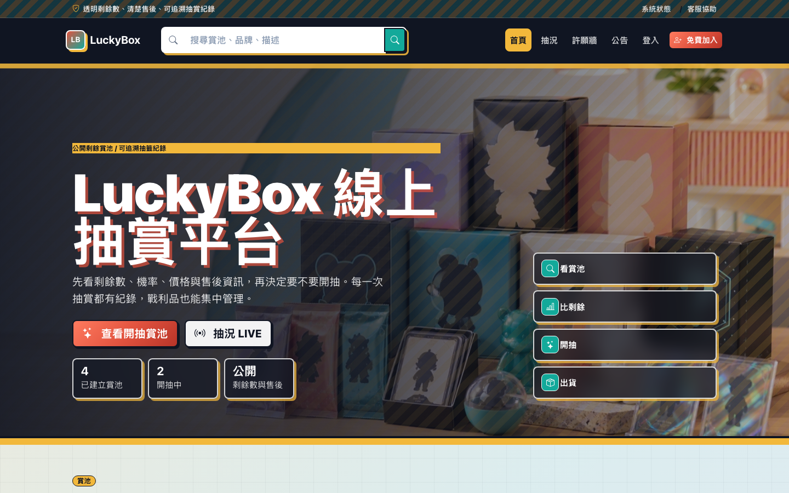
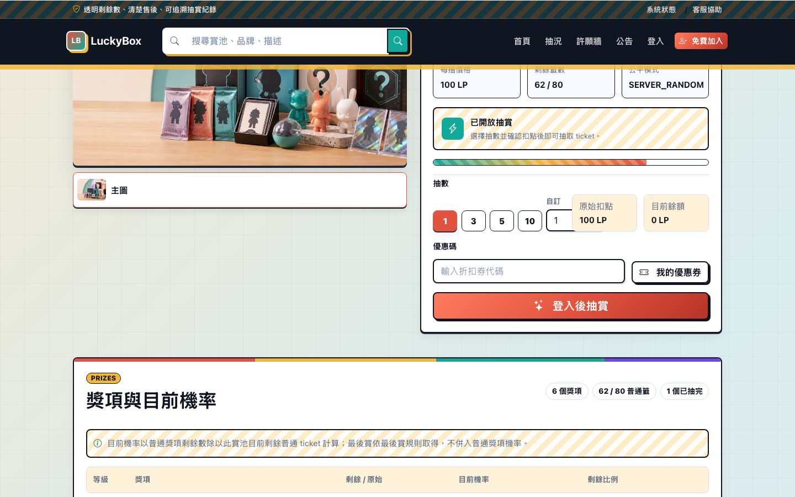
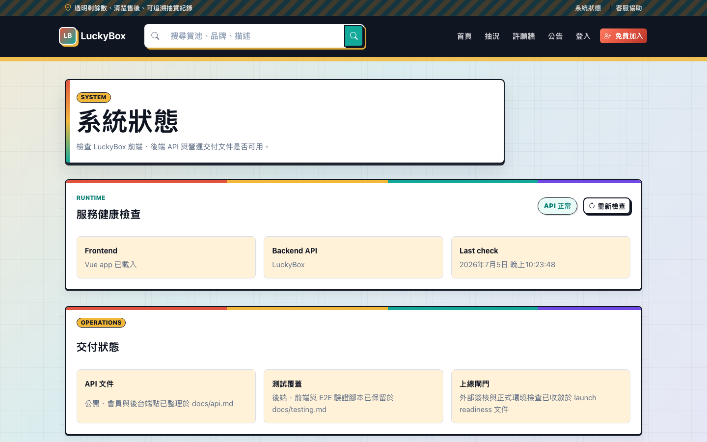
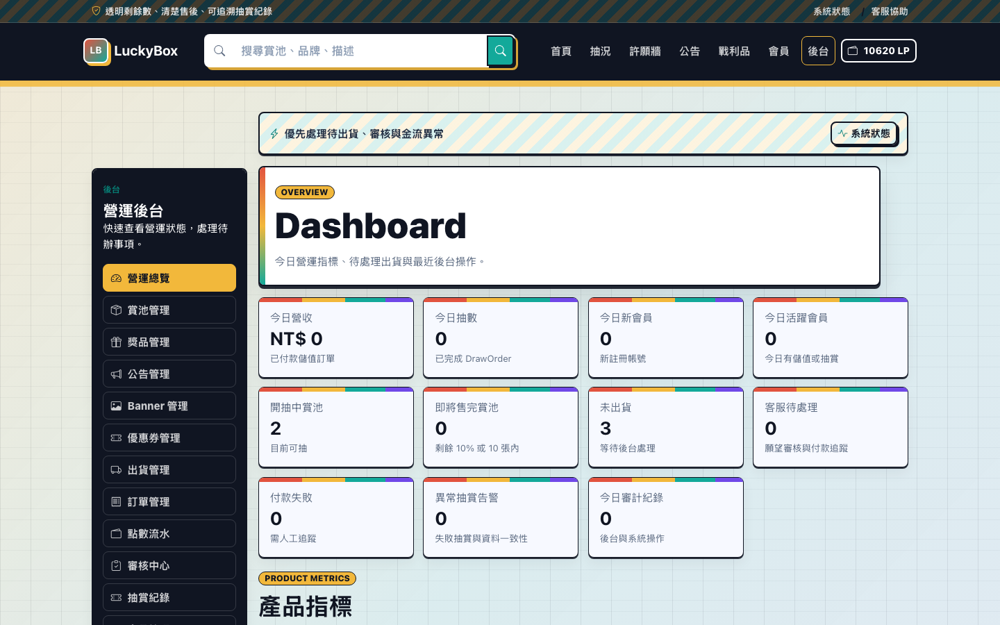
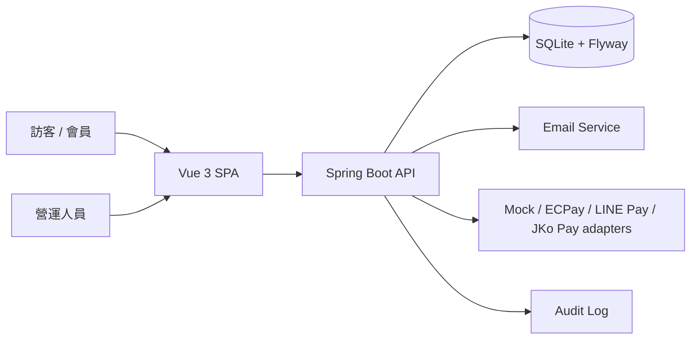

# LuckyBox 線上抽賞平台

LuckyBox 是一個以台灣收藏玩家為情境設計的線上一番賞 / 抽賞 side project。專案不只做「抽一下」的互動效果，而是從公開賞池、剩餘數與機率揭露、點數錢包、抽賞交易、戰利品保管、合併出貨，到營運後台、稽核紀錄與上線檢查，完整模擬一個可營運的抽賞平台。



## 專案亮點

- **前台體驗完整**：首頁探索、賞池詳情、公開抽況、公告、許願牆、FAQ、客服、政策頁與系統狀態頁。
- **抽賞流程可追溯**：顯示剩餘籤數、目前機率、最後賞規則、抽出紀錄與 fairness 說明。
- **會員流程完整**：註冊登入、點數錢包、Mock checkout 儲值、抽賞訂單、戰利品、優惠券與出貨申請。
- **後台可營運**：儀表板、賞池管理、獎項與票券生成、出貨、會員、訂單、點數流水、公告、Banner、優惠券、審核與稽核紀錄。
- **工程面完整**：Vue 3 SPA、Spring Boot API、SQLite/Flyway migration、Spring Security、表單驗證、單元測試、E2E 測試與 single-package 打包。

## 畫面展示

### 賞池詳情與抽賞入口

賞池頁聚焦在「抽之前看得懂」：價格、剩餘數、抽數選擇、優惠券、獎項機率與最後賞資訊都在同一個決策流程中呈現。



### 系統狀態與交付資訊

系統狀態頁用來檢查前端、後端 API 與交付文件是否可用，方便在開發與展示時快速確認環境。



### 營運後台

後台提供營運儀表板與管理側導覽，支援賞池、獎品、出貨、訂單、點數、審核、公告與稽核等日常營運任務。



## 功能範圍

| 模組 | 已實作內容 |
| --- | --- |
| 公開首頁 | Hero Banner、賞池列表、搜尋、分類、熱門賞池、LIVE 抽況、新手任務、客服入口 |
| 賞池詳情 | 圖片展示、價格與剩餘數、抽數選擇、優惠券、獎項機率、最後賞、近期抽出紀錄、FAQ、出貨與退換貨資訊 |
| 會員帳號 | 註冊、登入、個人資料、地址、錢包、儲值、抽賞紀錄、戰利品、出貨、優惠券 |
| 抽賞交易 | 點數扣抵、批量抽、票券扣庫存、抽賞結果、戰利品入庫、抽賞訂單查詢 |
| 後台營運 | Dashboard、賞池 CRUD、獎項與 ticket 生成、會員管理、出貨管理、付款訂單、點數流水、公告、Banner、優惠券、審核中心 |
| 信任與稽核 | 剩餘數揭露、目前機率、抽出紀錄、fairness proof、audit log、管理員權限、2FA 設定 |
| 上線準備 | 金流設定、SMTP 設定、備份腳本、smoke test、launch readiness 文件與簽核清單 |

## 技術架構



### 技術選型

| 層級 | 技術 |
| --- | --- |
| Frontend | Vue 3、Vue Router、Pinia、Axios、Bootstrap 5、Bootstrap Icons、Vite |
| Backend | Java 21、Spring Boot、Spring MVC、Spring Security、Spring Validation、Spring JDBC |
| Database | SQLite、Flyway migration |
| Test | Vitest、Vue Test Utils、Playwright、JUnit 5、Mockito、MockMvc |
| Tooling | Maven Wrapper、npm scripts、launch readiness scripts |

## 專案結構

```text
LuckyBox/
├── backend/                 # Spring Boot API、migration、domain services
├── frontend/                # Vue 3 SPA、前台、會員中心與後台介面
├── docs/                    # API、測試、營運 SOP、上線檢查文件
│   └── readme/              # README 截圖素材
├── scripts/                 # readiness、backup、smoke test 等營運腳本
├── PROJECT_DEVELOPMENT_PLAN.md
└── README.md
```

## 本機啟動

### 前置需求

- Java 21
- Node.js `^20.19.0` 或 `>=22.12.0`
- npm

### 啟動後端

```sh
cd backend
./mvnw spring-boot:run
```

後端預設啟動於 `http://localhost:8080`。開發資料庫會自動建立在：

```text
backend/data/luckybox-dev.sqlite
```

預設會執行 development seed，建立測試賞池與本機開發用管理員帳號；若不需要 seed，可設定：

```sh
LUCKYBOX_SEED_ENABLED=false
```

### 啟動前端

```sh
cd frontend
npm install
npm run dev
```

前端預設啟動於 `http://localhost:5173`，Vite 會將 `/api` proxy 到 `http://127.0.0.1:8080`。

## 常用路徑

| 頁面 | 路徑 |
| --- | --- |
| 首頁 | `/` |
| 賞池詳情 | `/kuji/star-collection-vol-1` |
| 會員登入 | `/login` |
| 會員中心 | `/account` |
| 戰利品 | `/account/prizes` |
| 公開抽況 | `/leaderboard` |
| 客服協助 | `/contact` |
| 系統狀態 | `/status` |
| 後台登入 | `/admin/login` |
| 營運後台 | `/admin` |

## 測試與驗證

### 前端

```sh
cd frontend
npm run lint
npm run test
npm run build
npx playwright test --project=chromium
```

### 後端

```sh
cd backend
./mvnw test
./mvnw package
```

### 單一 jar 打包

```sh
cd frontend
npm run build

cd ../backend
./mvnw -Psingle-package -DskipTests package
```

## 營運與上線檢查

```sh
scripts/check-launch-readiness.sh --help
scripts/generate-launch-evidence-template.sh --help
scripts/backup-luckybox.sh --help
scripts/smoke-test.sh --help
```

正式上線前請依序檢查：

- `docs/launch-readiness.md`
- `docs/launch-signoff-register.md`
- `docs/operations.md`
- `docs/sops/`
- `docs/payment-provider-expansion.md`

## 設計原則

- **透明優先**：抽賞前揭露價格、剩餘數、獎項配置、目前機率與最後賞規則。
- **流程閉環**：抽賞不是終點，後續還有戰利品保管、合併出貨、客服與稽核。
- **後台先行**：side project 也要像真實產品一樣能上架、暫停、查單、出貨、補償與追蹤。
- **測試保護核心交易**：點數、抽籤、庫存、付款 webhook、出貨與管理員權限都需要測試覆蓋。

## 注意事項

- 本專案是 side project 與工程展示，不代表已完成正式商用法遵審查。
- 不要提交真實 API key、金流密鑰、SMTP 密碼、會員個資或正式管理員憑證。
- 正式環境不可使用未授權動漫、角色、品牌或官方商品圖片。
- 線上抽賞涉及消費者保護、機率揭露、個資、金流、稅務、商標與 IP 授權，正式上線前必須完成外部法務、金流、物流與資安檢查。
